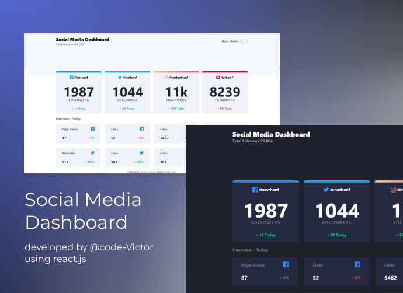

<!-- Please update value in the {}  -->

<h1 align="center">Social Media Dashboard</h1>

   coding challenge from <a href="http://frontendMentor.com" target="_blank">frontendMentor</a>.

  <h3>
    <a href="https://code-victor.github.io/dashboard-frontend-mentor/">
      Demo
    </a>
     | 
    <a href="https://github.com/Code-Victor/dashboard-frontend-mentor">
      Solution
    </a>
     | 
    <a href="#">
      Challenge
    </a>
  </h3>

<!-- TABLE OF CONTENTS -->

## Table of Contents

- [Overview](#overview)
  - [Built With](#built-with)
- [Features](#features)
- [Contact](#contact)
- [Acknowledgements](#acknowledgements)

<!-- OVERVIEW -->

## Overview

A static social Media Dashboard with light and dark Mode and nice user interface
you can view the demo <a href="https://code-victor.github.io/dashboard-frontend-mentor/">here</a>.it was a little easy,but I had some problems with my tailwind config file.I've gotten better at it tho.

### Built With

<!-- This section should list any major frameworks that you built your project using. Here are a few examples.-->

- [React](https://reactjs.org/)
- [Tailwind](https://tailwindcss.com/)

## Features

<!-- List the features of your application or follow the template. Don't share the figma file here :) -->

This application/site was created as a submission to a [FrontenMentor](https://frontendmentor.com) challenge. The [challenge](https://www.frontendmentor.io/challenges/social-media-dashboard-with-theme-switcher-6oY8ozp_H) was to build an application to complete the given user stories.

## Acknowledgements

<!-- This section should list any articles or add-ons/plugins that helps you to complete the project. This is optional but it will help you in the future. For exmpale -->

- [dealing with tailwind config file](https://v2.tailwindcss.com/docs/configuration#variants)
- [react js](https://reactjs.org/)
- [vs code shortcuts](https://code.visualstudio.com/shortcuts/keyboard-shortcuts-windows.pdf)

## Contact

- GitHub [@Code-Victor](https://github.com/Code-Victor)
- Twitter [@VictorFiery](https://twitter.com/VictorFiery)
